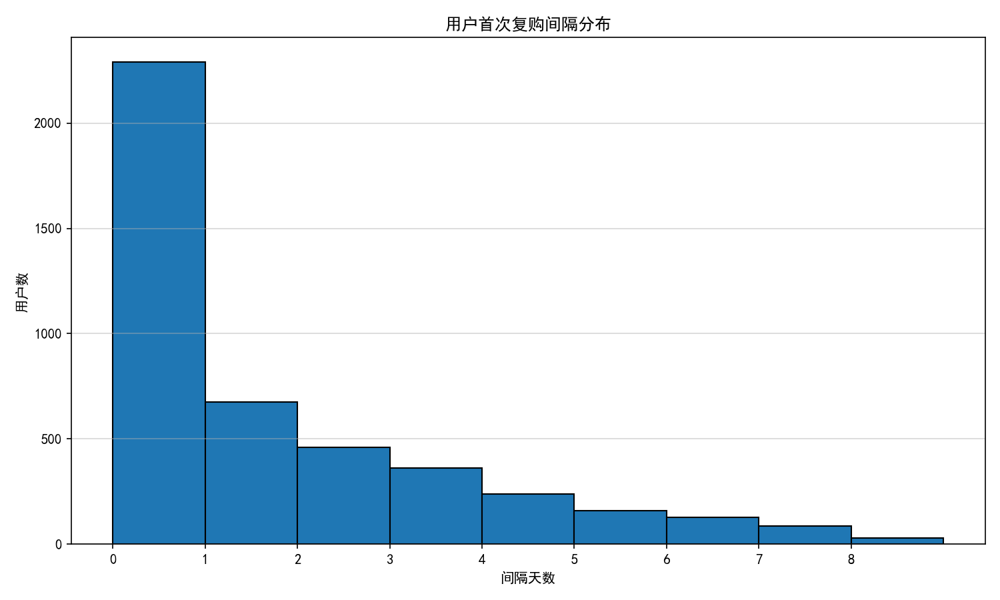
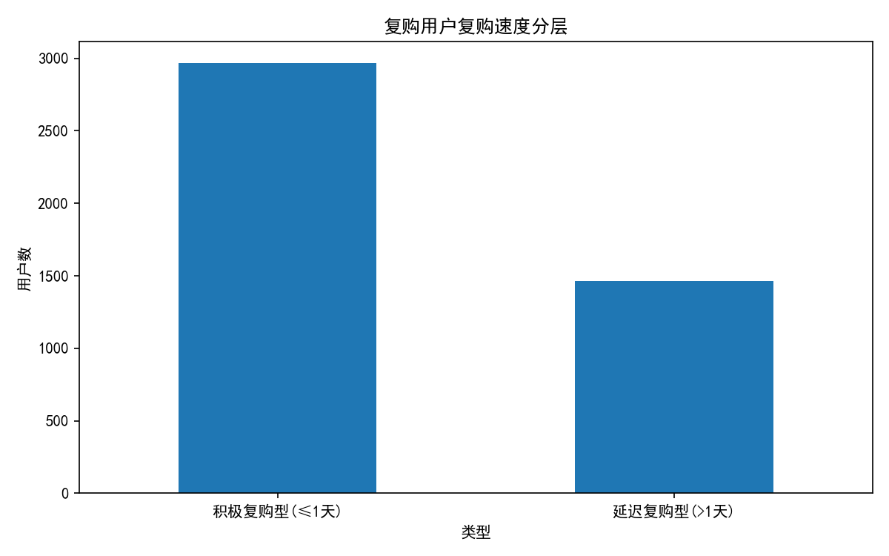
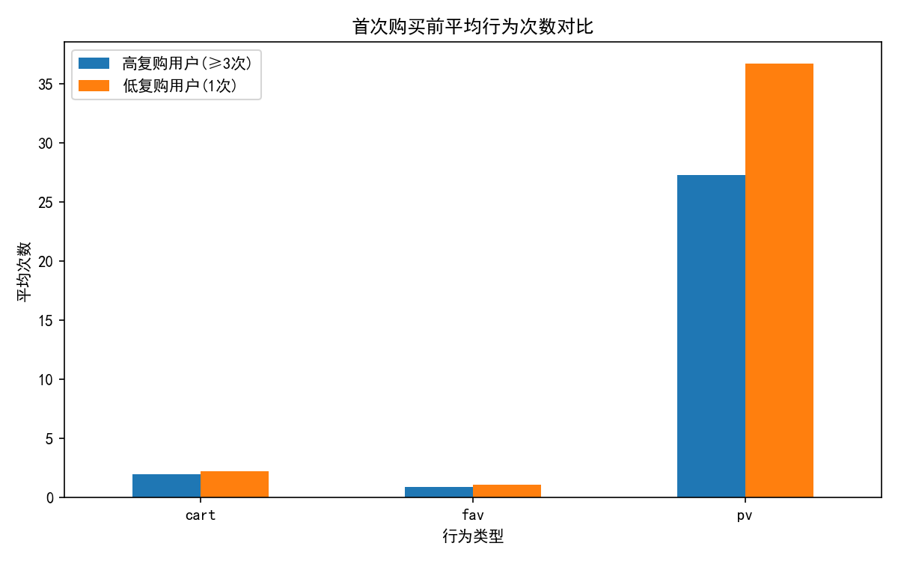
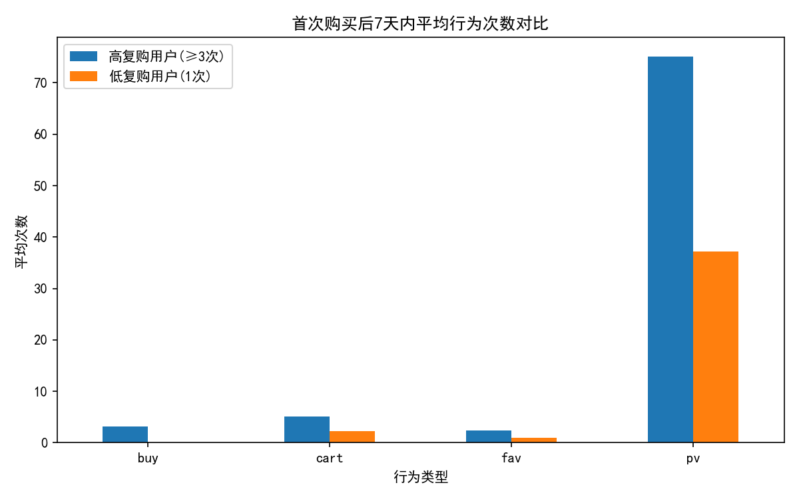
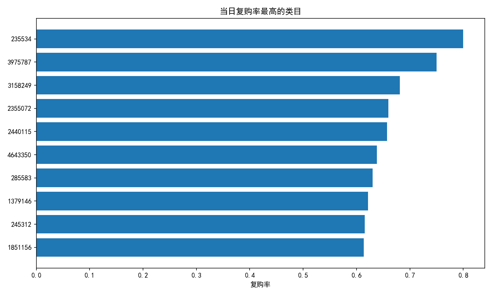
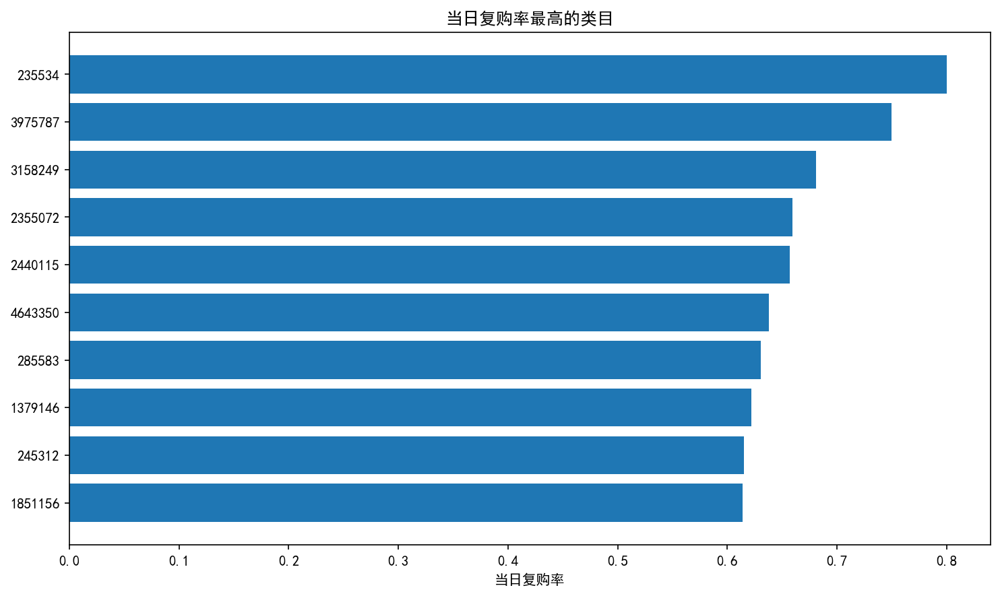
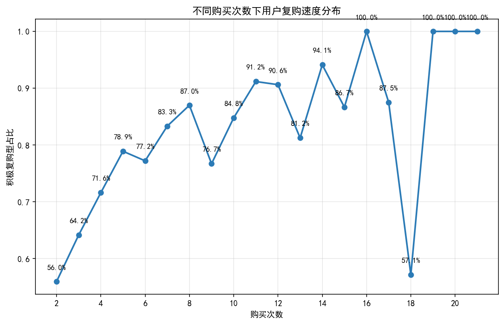
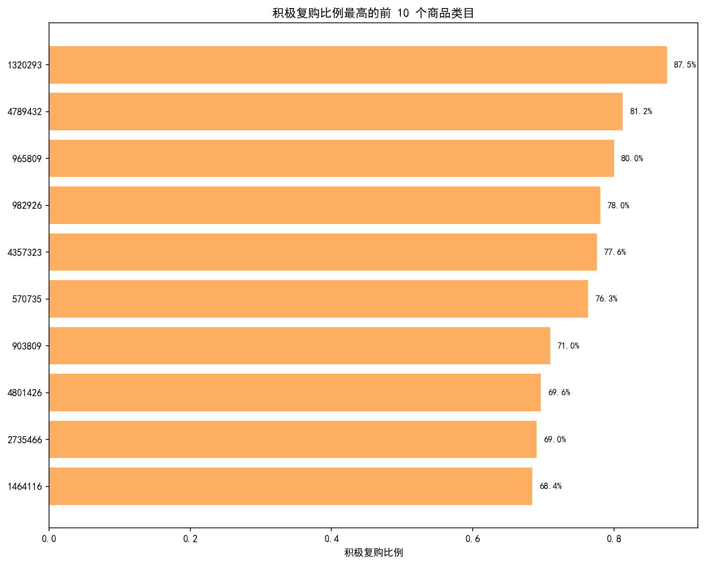
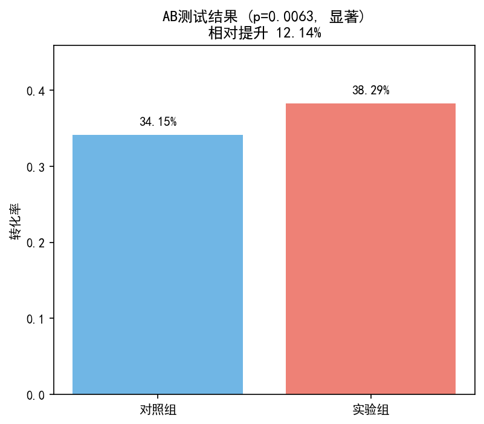

# 电商用户大促期间即时复购行为分析

## 项目简介

本项目基于阿里天池“淘宝用户行为数据集”，聚焦 **双十二大促预热期（2017.11.25-12.03）** 的用户购买行为，分析 **用户即时复购（当日/次日复购）** 的关键影响因素，为运营团队提供可落地的转化策略。

**核心问题**：大促期间，如何利用用户首购后的“黄金窗口”提升当日复购率？

## 数据来源与处理

- **数据集**：阿里天池 `UserBehavior.csv`，抽样 100 万行。
- **时间范围**：2017-11-25 ~ 2017-12-03（共 9 天）。
- **字段说明**：
  - `user_id`：用户标识
  - `item_id`：商品标识
  - `item_category`：商品类目标识
  - `behavior_type`：行为类型，包括 `pv`(点击), `buy`(购买), `cart`(加购), `fav`(收藏)
  - `time`：行为时间戳（秒级）
- **预处理**：
  - 时间戳转换为 datetime 格式，提取日期。
  - 筛选购买行为（`behavior_type == 'buy'`），共 **20,359 条购买记录**，涉及 **6,689 名用户**。
  - 计算每个用户的首次购买时间，并标记每次购买间隔天数（`days_diff`）。

## 核心指标与洞察

| 指标 | 数值 | 业务含义 |
|------|------|----------|
| 总购买用户数 | 6,689 | 样本中至少购买一次的用户 |
| **当日复购率** | **34.27%** | 每 3 个用户中就有 1 人在首购**当天**再次购买，大促凑单效应显著 |
| **次日复购率** | **10.08%** | 次日复购意愿大幅下降，干预窗口极短 |
| 平均复购间隔 | 1.36 天 | 被少数长间隔用户拉高 |
| 复购间隔中位数 | 0 天 | 超过一半的复购发生在首购当天 |



## 用户分层分析

### 1. 购买次数分层

| 分层 | 定义 | 人数 | 占比 |
|------|------|------|------|
| 高复购用户 | 购买次数 ≥ 3 | 2,855 | 42.7% |
| 中复购用户 | 购买次数 = 2 | 1,574 | 23.5% |
| 低复购用户 | 购买次数 = 1 | 2,260 | 33.8% |

> 高复购用户是核心价值人群，需重点维护；低复购用户是需要唤醒的对象。

### 2. 复购速度分层（仅针对有复购用户）

| 类型 | 定义 | 人数 | 占有复购用户比例 |
|------|------|------|----------------|
| 积极复购型 | 间隔 ≤ 1 天 | 2,966 | 86.1% |
| 延迟复购型 | 间隔 > 1 天 | 1,463 | 42.5% |

> 86% 的复购用户属于“积极复购型”，印证了即时干预的必要性。



## 行为对比：高复购 vs 低复购用户

### 首次购买前行为（平均值）

| 行为类型 | 高复购用户 (≥3次) | 低复购用户 (1次) |
|----------|------------------|----------------|
| 点击 (pv) | 27.32 | 36.70 |
| 加购 (cart) | 1.98 | 2.23 |
| 收藏 (fav) | 0.93 | 1.12 |



**发现**：高复购用户在购买前的浏览、加购、收藏反而更少。  
**解读**：高复购用户目标明确，决策路径短；低复购用户“逛得多”但转化后易流失。

### 首次购买后 7 天内行为（平均值）

| 行为类型 | 高复购用户 (≥3次) | 低复购用户 (1次) |
|----------|------------------|----------------|
| 再次购买 (buy) | 3.15 | 0.00 |
| 加购 (cart) | 5.09 | 2.23 |
| 收藏 (fav) | 2.34 | 1.02 |
| 点击 (pv) | 75.02 | 37.19 |



**发现**：高复购用户购买后的互动（浏览、加购、收藏）远超低复购用户。  
**解读**：首次购买后的持续互动是复购的最强预测信号。低复购用户下单后迅速“沉默”，需要主动激活。

## 商品类目分析

### 整体复购率 TOP 10 类目

| item_category | total_users | repurchase_users | repurchase_rate |
|---------------|-------------|------------------|----------------|
| 3738615 | 71 | 68 | 95.77% |
| 846990 | 61 | 58 | 95.08% |
| 4643350 | 58 | 55 | 94.83% |
| 3598912 | 54 | 51 | 94.44% |
| 3231625 | 66 | 62 | 93.94% |
| 1973012 | 58 | 54 | 93.10% |
| 3002561 | 143 | 133 | 93.01% |
| 3299155 | 56 | 52 | 92.86% |
| 245312 | 52 | 48 | 92.31% |
| 2355072 | 91 | 84 | 92.31% |



> 这些类目天然具有高复购属性（如日用品、快消品）。用户首次购买后推荐同类或互补商品，可有效提升复购。

### 当日复购率 TOP 10 类目（核心）

| item_category | total_users | same_day_users | same_day_rate |
|---------------|-------------|----------------|----------------|
| 235534 | 30 | 24 | 80.0% |
| 3975787 | 36 | 27 | 75.0% |
| 3158249 | 47 | 32 | 68.1% |
| 2355072 | 91 | 60 | 65.9% |
| 2440115 | 35 | 23 | 65.7% |
| 4643350 | 58 | 37 | 63.8% |
| 285583 | 46 | 29 | 63.0% |
| 1379146 | 37 | 23 | 62.2% |
| 245312 | 52 | 32 | 61.5% |
| 1851156 | 44 | 27 | 61.4% |



> 这些类目最能刺激用户“冲动型”即时复购，适合放在订单完成页的“凑单推荐”模块中。

## 交叉分析

### 购买次数 vs 复购速度

随着用户购买次数增加，积极复购型（间隔≤1天）的占比迅速上升。例如，购买次数为 2 的用户中，积极复购型占比约 56%；购买次数≥10 的用户中，占比超过 90%。



### 高积极复购类目 TOP 10

以下类目的用户中，积极复购比例最高，适合作为首购后即时推荐的目标类目。



## 从洞察到策略（逻辑链条）

| 关键发现 | 业务洞察 | 衍生策略 | 策略目标 |
|----------|----------|----------|----------|
| 当日复购率34.27%，中位复购间隔 **0 天** | 用户决策窗口极短，半数复购发生在首购当天 | **策略1：订单完成页即时推荐** – 在支付成功页立即展示高复购类目及限时折扣 | 抓住当天“冲动”窗口，提升当日复购率 |
| 高复购用户购买后互动（加购/收藏/浏览）远超低复购用户 | 购买后的持续互动是复购的强信号；低复购用户下单后迅速“沉默” | **策略2：购买后 1 小时内沉默唤醒** – 对未互动用户推送限时秒杀提醒 | 激活沉默用户，促进次日复购 |
| 识别出整体复购率>92% 及当日复购率 60-80% 的类目 | 部分类目天然具有高复购属性，适合作为推荐标的 | **策略3：高复购类目定向曝光** – 在首页增加“常买常新”模块，推荐高复购类目 | 提升跨品类复购率 |
| 购买次数越多的用户，积极复购比例越高（≥10次用户超90%） | 高频用户决策更快，对即时激励更敏感 | 策略1 中针对高频用户可适当提高优惠力度 | 提升高价值用户转化效率 |

## 业务策略建议

| 策略 | 依据 | 具体动作 | 预期效果 |
|------|------|----------|----------|
| **策略1：订单完成页即时推荐** | 当日复购率 34.27%，中位间隔 0 天 | 支付成功页展示“高当日复购类目 Top3 + 满 2 件 9 折”模块 | 当日复购率 ↑3~5 个百分点 |
| **策略2：购买后 1 小时内沉默唤醒** | 低复购用户购买后无互动 | 对首购后 1 小时内未再次下单的用户推送“限时秒杀+高复购类目” | 次日复购率 ↑2~3 个百分点 |
| **策略3：高复购类目定向曝光** | 整体复购率 > 92% | 对首次购买该类目商品的用户，在首页增加“常买常新”模块 | 跨品类复购率提升 |

## AB测试方案（以策略1为例）

- **实验设计**：实验组（订单完成页新增“凑单推荐”模块） vs 对照组（原流程）
- **核心指标**：当日复购率
- **样本量估算**：基准 34.27% → 预期 38%，α=0.05（单尾），1-β=0.8，每组需 **2,050 人**
- **模拟结果**：对照组 34.15%，实验组 38.29%，p=0.0063（显著），策略有效



详细代码见 `scripts/ab_testing.py`。

## 局限性说明

- 数据时间窗口仅 9 天，结论适用于大促短期转化场景。
- 当日复购包含“同店凑单”和“跨店购买”，未进一步区分。
- 数据为抽样（100 万行），全量数据结果可能略有波动。

## 项目结构

```
- data/               # 原始数据（需自行下载 UserBehavior.csv）
- output/
  - tables/           # 中间表（purchase_data.csv）
  - figures/          # 生成的图表（可复制到 images/ 用于 README）
- scripts/
  - config.py         # 路径配置
  - data_loader.py    # 数据加载与清洗
  - metrics.py        # 购买记录提取
  - analysis.py       # 所有分析函数
  - main.py           # 主流程
  - ab_testing.py     # AB测试模块
- images/             # README 用图片（从 output/figures 复制）
- .gitignore
- requirements.txt
- README.md           # 本文件
```

## 如何运行

1. 将 `UserBehavior.csv` 放入 `data/` 文件夹。
2. 安装依赖：`pip install -r requirements.txt`
3. 运行 `python scripts/main.py` 生成所有结果和图表。
4. 运行 `python scripts/ab_testing.py` 进行 AB 测试模拟。

## 作者

[Jasmine]  
项目链接：https://github.com/Tay12tay13/Ecommerce_Repurchase_Analysis

---

*本项目为实习作品集项目，完整展示了从问题定义、数据清洗、特征工程、可视化到策略建议与 AB 测试设计的闭环能力。*


